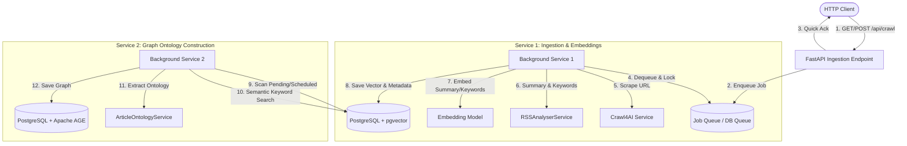

# Asynchronous Pipeline: Crawling, Vector Embeddings, and Graph Ontologies

This document outlines the architectural patterns and implementations for transforming the current synchronous crawl-and-analyze flow in [app.py](file:///home/vasu/Documents/GitHub/RSSFeed/ai/app.py) into an asynchronous, decoupled pipeline.

## 1. Architectural Overview



The system is decoupled into two asynchronous background services:
1. **Service 1 (Ingestion & Vectorization)**: Fetches the raw article, extracts summaries and keywords using [RSSAnalyserService](file:///home/vasu/Documents/GitHub/RSSFeed/ai/services/articleanalysis.py), computes embeddings, and stores them in PostgreSQL using **pgvector**.
2. **Service 2 (Graph Ontology Layer)**: Fetches related articles based on vector similarity or keyword matches, extracts ontology relationships using [ArticleOntologyService](file:///home/vasu/Documents/GitHub/RSSFeed/ai/services/articleontology.py), and updates the graph database using **Apache AGE**.

---

## 2. Background Task Orchestration Options

To move processing out of the request-response cycle, three queue models are proposed:

### Option A: FastAPI BackgroundTasks (In-Memory)
FastAPI provides a built-in `BackgroundTasks` class to run jobs after sending a response.
* **Pros**: Simple, zero dependencies, no additional server processes.
* **Cons**: In-memory queue. If the FastAPI process restarts or crashes, queued/running tasks are lost. Doesn't scale across multiple machines.

### Option B: PostgreSQL-Backed Queue (Recommended for Low Footprint)
Since PostgreSQL is already being used for both vector storage and Apache AGE, we can implement a highly reliable queue inside Postgres using standard transaction locking (`SELECT ... FOR UPDATE SKIP LOCKED`).
* **Pros**: Zero new infrastructure, fully transactional (jobs are only committed/completed if the database transaction succeeds), supports multiple concurrent workers safely.
* **Cons**: Introduces polling load on Postgres.

### Option C: Distributed Worker Queue (Celery + Redis/RabbitMQ)
Use a dedicated broker (like Redis or RabbitMQ) and a framework like Celery or Dramatiq.
* **Pros**: Industry-standard, built-in retry mechanisms, rate-limiting, progress tracking, independent scaling of workers.
* **Cons**: Requires managing a separate queue broker and worker processes.

---

## 3. Implementing Service 1: Ingestion & pgvector

### 3.1 pgvector Database Schema

First, enable the `vector` extension and define the database schema. This assumes an embedding dimension of **1536** (standard for OpenAI `text-embedding-3-small` or Ollama's `nomic-embed-text` etc.).

```sql
-- Enable pgvector extension
CREATE EXTENSION IF NOT EXISTS vector;

-- Table for storing article content and their vector embeddings
CREATE TABLE articles (
    id SERIAL PRIMARY KEY,
    url TEXT UNIQUE NOT NULL,
    title TEXT NOT NULL,
    summary TEXT[] NOT NULL, -- list of summary bullets
    keywords TEXT[] NOT NULL,
    country VARCHAR(100),
    content TEXT, -- crawled markdown
    embedding vector(1536), -- Vector column
    ontology_processed BOOLEAN DEFAULT FALSE,
    created_at TIMESTAMP WITH TIME ZONE DEFAULT CURRENT_TIMESTAMP
);

-- HNSW Index for fast cosine similarity search
CREATE INDEX ON articles USING hnsw (embedding vector_cosine_ops);
```

### 3.2 Service 1 Implementation (Python)

Below is the code for the background worker that processes URLs, computes embeddings, and saves them to the relational database.

```python
import os
import psycopg2
from psycopg2.extras import register_vector # Needs pgvector python package
from langchain_ollama import OllamaEmbeddings # Or OpenAIEmbeddings
from services.crawl import Crawl
from services.articleanalysis import RSSAnalyserService

class IngestionWorker:
    def __init__(self, db_uri: str, ollama_url: str):
        self.conn = psycopg2.connect(db_uri)
        # Register pgvector typecaster
        register_vector(self.conn)
        
        # Configure embedding model (e.g. nomic-embed-text)
        self.embeddings = OllamaEmbeddings(
            base_url=ollama_url,
            model="nomic-embed-text"
        )

    def process_article(self, crawler_service: Crawl, analyzer: RSSAnalyserService, url: str):
        # 1. Scrape Article
        import asyncio
        markdown_content = asyncio.run(crawler_service.run(url))
        
        # 2. Extract Metadata & Summary
        analysis = analyzer.analyze_text(markdown_content)
        
        # 3. Create Vector Embedding (embed title + summary + keywords)
        text_to_embed = f"Title: {analysis.title}\nSummary: {' '.join(analysis.summary)}\nKeywords: {', '.join(analysis.keywords)}"
        vector = self.embeddings.embed_query(text_to_embed)
        
        # 4. Save to pgvector
        try:
            with self.conn.cursor() as cursor:
                cursor.execute(
                    """
                    INSERT INTO articles (url, title, summary, keywords, country, content, embedding)
                    VALUES (%s, %s, %s, %s, %s, %s, %s)
                    ON CONFLICT (url) DO UPDATE SET
                        title = EXCLUDED.title,
                        summary = EXCLUDED.summary,
                        keywords = EXCLUDED.keywords,
                        content = EXCLUDED.content,
                        embedding = EXCLUDED.embedding,
                        ontology_processed = FALSE;
                    """,
                    (url, analysis.title, analysis.summary, analysis.keywords, analysis.country, markdown_content, vector)
                )
            self.conn.commit()
            print(f"Ingested and embedded article: {analysis.title}")
        except Exception as e:
            self.conn.rollback()
            print(f"Failed to save article {url}: {e}")
```

---

## 4. Implementing Service 2: Keyword Retrieval & Apache AGE

Service 2 queries the database to find related articles based on vector similarity or keyword overlap, feeds them to the ontology generator, and persists them into **Apache AGE**.

### 4.1 Apache AGE Schema and Setup

Apache AGE operates inside PostgreSQL as a graph engine. You create a graph namespace, and all Cypher operations operate in that namespace.

```sql
-- Load the Apache AGE extension
CREATE EXTENSION IF NOT EXISTS age;
LOAD 'age';

-- Set the search path to include ag_catalog
SET search_path = ag_catalog, "$user", public;

-- Initialize the Graph
SELECT create_graph('rss_ontology_graph');
```

### 4.2 Querying Related Articles (Hybrid Search)

To fetch existing articles from the database that share keywords and semantic context:

```sql
-- Cosine similarity distance operator is <=> (lower means more similar)
-- This query grabs the top 5 articles within a cosine threshold of 0.3
SELECT id, title, keywords 
FROM articles 
WHERE embedding <=> %s < 0.3 AND url != %s
ORDER BY embedding <=> %s 
LIMIT 5;
```

### 4.3 Service 2 Implementation (Python)

Below is the code for the background worker that extracts ontologies for related articles and writes nodes/edges to the Apache AGE graph namespace.

```python
import re
import psycopg2
from typing import List
from langchain_ollama import OllamaEmbeddings
from services.articleontology import ArticleOntologyService, ArticleOntology

class OntologyWorker:
    def __init__(self, db_uri: str, ollama_url: str):
        self.conn = psycopg2.connect(db_uri)
        # AGE requires loading the library and setting the search path on connection
        with self.conn.cursor() as cursor:
            cursor.execute("LOAD 'age';")
            cursor.execute("SET search_path = ag_catalog, '$user', public;")
        self.conn.commit()
        
        self.embeddings = OllamaEmbeddings(
            base_url=ollama_url,
            model="nomic-embed-text"
        )

    def find_related_articles(self, embedding: List[float], source_url: str) -> List[dict]:
        with self.conn.cursor() as cursor:
            cursor.execute(
                """
                SELECT title, content, keywords 
                FROM articles 
                WHERE embedding <=> %s < 0.4 AND url != %s
                ORDER BY embedding <=> %s
                LIMIT 5;
                """,
                (embedding, source_url, embedding)
            )
            rows = cursor.fetchall()
            return [{"title": r[0], "content": r[1], "keywords": r[2]} for r in rows]

    def sanitize_label(self, label: str) -> str:
        # Apache AGE labels must match alphanumeric and underscore rules
        # Cypher relation types cannot contain dynamic variables directly;
        # they must be sanitized and formatted into the query string safely.
        clean = re.sub(r'[^a-zA-Z0-9_]', '', label).upper()
        return clean if clean else "RELATED_TO"

    def save_ontology_to_age(self, ontology: ArticleOntology, article_title: str):
        """
        Inserts Entities as Vertices and Relationships as Edges inside Apache AGE.
        Uses Cypher MERGE commands for idempotence.
        """
        try:
            with self.conn.cursor() as cursor:
                # 1. Create Article Node
                cursor.execute(
                    """
                    SELECT * FROM cypher('rss_ontology_graph', $$
                        MERGE (a:Article {title: %s})
                        RETURN a
                    $$) as (a agtype);
                    """,
                    (article_title,)
                )

                # 2. Bulk upsert entities
                for entity in ontology.entities:
                    # Sanitize label type (e.g. 'Person', 'Organization')
                    label = self.sanitize_label(entity.type)
                    
                    cursor.execute(
                        f"""
                        SELECT * FROM cypher('rss_ontology_graph', $$
                            MERGE (e:{label} {{name: %s}})
                            RETURN e
                        $$) as (e agtype);
                        """,
                        (entity.name,)
                    )

                # 3. Create connections from Article to its Entities
                for entity in ontology.entities:
                    label = self.sanitize_label(entity.type)
                    cursor.execute(
                        f"""
                        SELECT * FROM cypher('rss_ontology_graph', $$
                            MATCH (a:Article {{title: %s}}), (e:{label} {{name: %s}})
                            MERGE (a)-[r:MENTIONS]->(e)
                            RETURN r
                        $$) as (r agtype);
                        """,
                        (article_title, entity.name)
                    )

                # 4. Insert Relationships between Entities
                for rel in ontology.relationships:
                    # Find matching entity types for source and target
                    # (Required since Apache AGE Cypher needs a matching label for index efficiency)
                    src_label = "Entity"
                    tgt_label = "Entity"
                    
                    for e in ontology.entities:
                        if e.name == rel.source:
                            src_label = self.sanitize_label(e.type)
                        if e.name == rel.target:
                            tgt_label = self.sanitize_label(e.type)

                    edge_type = self.sanitize_label(rel.relation_type)

                    # Create dynamic edge
                    cursor.execute(
                        f"""
                        SELECT * FROM cypher('rss_ontology_graph', $$
                            MATCH (s:{src_label} {{name: %s}}), (t:{tgt_label} {{name: %s}})
                            MERGE (s)-[r:{edge_type}]->(t)
                            RETURN r
                        $$) as (r agtype);
                        """,
                        (rel.source, rel.target)
                    )

            self.conn.commit()
            print(f"Ontology for '{article_title}' successfully saved to Apache AGE.")
        except Exception as e:
            self.conn.rollback()
            print(f"Failed to save graph ontology for '{article_title}': {e}")

    def run_ontology_generation(self, ontology_service: ArticleOntologyService):
        """
        Polls for articles that haven't had their ontology built, searches 
        for related context, and runs LLM ontology extraction.
        """
        with self.conn.cursor() as cursor:
            # Select oldest unprocessed article using SELECT FOR UPDATE SKIP LOCKED
            cursor.execute(
                """
                SELECT id, url, title, content, embedding 
                FROM articles 
                WHERE ontology_processed = FALSE 
                LIMIT 1
                FOR UPDATE SKIP LOCKED;
                """
            )
            row = cursor.fetchone()
            if not row:
                return
            
            art_id, url, title, content, embedding = row
            
            # Find semantically related articles to enrich context
            related = self.find_related_articles(embedding, url)
            
            # Combine content for LLM ingestion
            context = f"Main Article:\n{content}\n\nRelated Articles Context:\n"
            for r in related:
                context += f"- Title: {r['title']}\n  Content Summary: {r['content'][:1000]}\n"
            
            # Extract Ontology
            print(f"Generating ontology for article: {title}")
            ontology = ontology_service.extract_ontology(context)
            
            # Save into Apache AGE
            self.save_ontology_to_age(ontology, title)
            
            # Mark processed
            cursor.execute(
                "UPDATE articles SET ontology_processed = TRUE WHERE id = %s;",
                (art_id,)
            )
            self.conn.commit()
```

---

## 5. Integrating with FastAPI Ingestion (`app.py`)

Here is how you can configure the FastAPI route to enqueue tasks asynchronously rather than doing blocking inline evaluation.

### Example Database Queue Ingestion Route

If using a lightweight DB queue:

```python
@app.post("/api/crawl")
async def crawl(url: str):
    # Instead of running the heavy crawl + LLM extraction synchronously,
    # insert a task record to be consumed by the background workers.
    try:
        # assuming app.state.db_connection is available
        with app.state.db_connection.cursor() as cursor:
            cursor.execute(
                """
                INSERT INTO crawl_jobs (url, status) 
                VALUES (%s, 'pending')
                ON CONFLICT (url) DO NOTHING;
                """,
                (url,)
            )
        app.state.db_connection.commit()
        return {"status": "enqueued", "url": url}
    except Exception as e:
        return {"status": "error", "message": str(e)}
```

---

## 6. Development and Testing Setup

### 6.1 Running Apache AGE with Docker
The easiest way to run Apache AGE is via the official Docker image:

```bash
docker run --name age-postgres \
  -e POSTGRES_USER=postgres \
  -e POSTGRES_PASSWORD=secret \
  -e POSTGRES_DB=rss_feed \
  -p 5432:5432 \
  -d apache/age
```

Then install the `pgvector` extension inside the container or compile it. Alternatively, build a custom Dockerfile with both `pgvector` and `Apache AGE` loaded on top of a standard PostgreSQL base image.

### 6.2 Validation Queries
To verify that vertices and edges are correctly written to the Apache AGE graph:

```sql
-- Retrieve all entities in the graph
SELECT * FROM cypher('rss_ontology_graph', $$
    MATCH (n)
    RETURN label(n), n.name, n.title
$$) as (label text, name text, title text);

-- Retrieve relationships
SELECT * FROM cypher('rss_ontology_graph', $$
    MATCH (s)-[r]->(t)
    RETURN label(s), s.name, type(r), label(t), t.name
$$) as (source_type text, source_name text, relation text, target_type text, target_name text);
```
